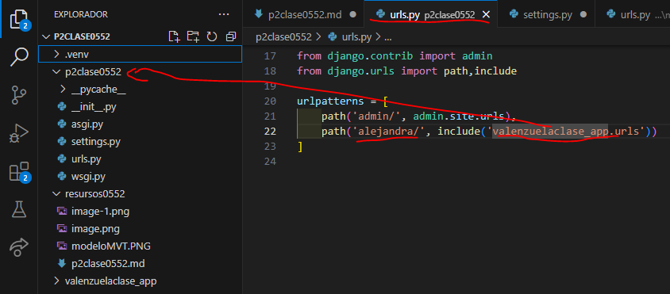

- crear aplicacion valenzuelaclase_app
- comando --> python manage.py startapp valenzuelaclase_app
- 
- En settings.py de p2clase0552
- 
- En urls.py de p2clase0552
- 
- En urls.py de valenzuelaclase_app
- 
- En views.py en valenzuelaclase_app
- 
- En urls en valenzuelaclase_app 
- 